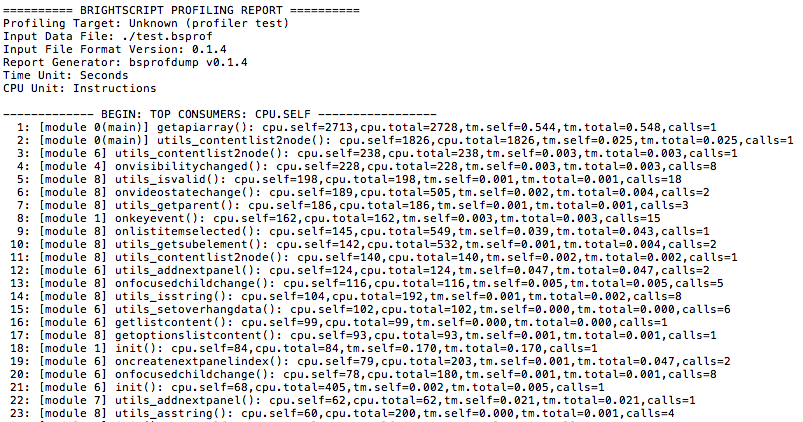

# BrightScript Profiler

### Overview

The BrightScript Profiler gathers important metrics such as CPU usage, "wall-clock" time (the real world time for functions to complete), and the number of times functions are called during the execution of your channel. This tool can help you analyze where performance improvements and efficiencies can be made in your channel.

**Sections:**

* [Requirements](#requirements)
* [Collecting the data](#collecting-the-data)
* [Processing the data](#processing-the-data)
* [Understanding the data](#understanding-the-data)
* [Using this data](#using-this-data)

---

## Requirements

### Roku OS

The BrightScript Profiler tool will be publicly available in the next Roku OS release but you can get early access and test out the tool now through the Beta Developer Program.

<p align="center"><a href="https://go.roku.com/dev-beta" target="_blank"></a></p>

### Manifest entries

Two new manifest entries are required to use the profiler:

| Attribute | Type   | Description | Sample manifest entry |
| --------- | ------ | ----------- | --------------------- |
| `bs_prof_enabled` | boolean | enable BrightScript profiling | `bs_prof_enabled=true`
| `bs_prof_sample_ratio` | float | the ratio at which profiling samples are taken | `bs_prof_sample_ratio=1.0`

The `bs_prof_sample_ratio` can be adjusted from `0.001` to `1.0`. A sample ratio of `1.0` is the default and will measure every BrightScript statement. A sample ratio of `1.0` will have some performance impact, but in most cases it won’t affect the usability of your channel and will provide the most accurate data. However,  if your channel is overly sluggish with a ratio of `1.0`, you can reduce the ratio to reduce the profiler’s overhead. A lower sample ratio will provide less accurate data, so it’s recommended that you use the highest ratio that still allows your channel to be usable.

## Collecting the data

Launch the channel as you normally would and run through your test cases. Once you exit the channel, open the page to your Roku device's [Developer Settings](/develop/developer-tools/developer-settings.md) and click on [Utilities](/develop/developer-tools/developer-settings.md#utilities).


After you've run through your channel's test cases, click on `Profiling Data` to generate a `.bsprof` file and a link to download the data from your Roku device.


The `.bsprof` format is unique to Roku to ensure the format is as efficient and small as possible and easy to generate even on low end Roku devices. Proceed to the next section to see how to access the data.

## Processing the data

The `.bsprof` file can be processed with the following command line utilities for Linux:

* [bsprofdump_linux_i686](https://devtools.web.roku.com/profiler/linux_i686/bsprofdump_linux_i686.zip)
* [bsprofdump_linux_x86_x64](https://devtools.web.roku.com/profiler/linux_x86_64/bsprofdump_linux_x86_64.zip)

**Sample command:**

`$ ./bsprofdump channel.bsprof`

This should generate a profiling report like the following:



> You can also output the data to a separate file like so:

> `$ ./bsprofdump channel.bsprof > channel-bsprof-log.txt`

## Understanding the data

The profiling data is divided into 4 main sections. The CPU time and wall-clock time sections are also divided into separate sections for `self` and `total`. `self` refers to the CPU/wall-clock time the function itself consumed whereas `total` also includes the time consumed by any callees (other functions called by the `self` function).

**Top CPU time consumers**

This section lists the top functions consuming the largest amount of CPU time (`cpu.self` or `cpu.total`). CPU time refers to the number of operations each function takes to complete and this number should be equal on low end and high end Roku devices. Other information such as the module the function belongs to, the wall-clock time (`tm.self` or `tm.total`), and the number of times the function was called (`calls`) is also displayed.

```
------------- BEGIN: TOP CONSUMERS: CPU.TOTAL (SELF+CALLEES) -----------------
 1: [module 0(main)] runuserinterface(): cpu.total=4594,cpu.self=40,tm.total=22.871,tm.self=22.298,calls=1
 2: [module 0(main)] <global>: cpu.total=4594,cpu.self=0,tm.total=22.871,tm.self=0.000,calls=0
 3: [module 0(main)] getapiarray(): cpu.total=2728,cpu.self=2713,tm.total=0.548,tm.self=0.544,calls=1
 4: [module 0(main)] utils_contentlist2node(): cpu.total=1826,cpu.self=1826,tm.total=0.025,tm.self=0.025,calls=1
 5: [module 8] <global>: cpu.total=1702,cpu.self=0,tm.total=0.476,tm.self=0.000,calls=0
 6: [module 6] <global>: cpu.total=788,cpu.self=0,tm.total=0.054,tm.self=0.000,calls=0
 7: [module 8] onlistitemselected(): cpu.total=549,cpu.self=145,tm.total=0.043,tm.self=0.039,calls=1
 8: [module 8] utils_getsubelement(): cpu.total=532,cpu.self=142,tm.total=0.004,tm.self=0.001,calls=2
 9: [module 8] onvideostatechange(): cpu.total=505,cpu.self=189,tm.total=0.004,tm.self=0.002,calls=2
 ...
```

**Top wall-clock time consumers**

This section lists the function calls consuming the greatest amount of wall-clock time. Wall-clock time refers to the real world time that a function takes to complete. This value can vary across different Roku devices. For example, a function may take an equal number of operations to complete across different Roku devices but low end Roku devices can take more real world time to complete one operation than a high end Roku device.

```
------------- BEGIN: TOP CONSUMERS: TIME.TOTAL (SELF+CALLEES) -----------------
 1: [module 0(main)] runuserinterface(): tm.total=22.871,tm.self=22.298,cpu.total=4594,cpu.self=40,calls=1
 2: [module 0(main)] <global>: tm.total=22.871,tm.self=0.000,cpu.total=4594,cpu.self=0,calls=0
 3: [module 0(main)] getapiarray(): tm.total=0.548,tm.self=0.544,cpu.total=2728,cpu.self=2713,calls=1
 4: [module 8] <global>: tm.total=0.476,tm.self=0.000,cpu.total=1702,cpu.self=0,calls=0
 5: [module 8] onvideovisibilitychange(): tm.total=0.420,tm.self=0.419,cpu.total=161,cpu.self=49,calls=1
 6: [module 1] <global>: tm.total=0.216,tm.self=0.000,cpu.total=287,cpu.self=0,calls=0
 7: [module 1] init(): tm.total=0.170,tm.self=0.170,cpu.total=84,cpu.self=84,calls=1
 8: [module 6] <global>: tm.total=0.054,tm.self=0.000,cpu.total=788,cpu.self=0,calls=0
 9: [module 6] oncreatenextpanelindex(): tm.total=0.047,tm.self=0.001,cpu.total=203,cpu.self=79,calls=2
10: [module 6] utils_addnextpanel(): tm.total=0.047,tm.self=0.047,cpu.total=124,cpu.self=124,calls=2
11: [module 8] onlistitemselected(): tm.total=0.043,tm.self=0.039,cpu.total=549,cpu.self=145,calls=1
12: [module 1] oncontent(): tm.total=0.043,tm.self=0.043,cpu.total=41,cpu.self=41,calls=1
...
```

**Function call counts**

As the name implies, this section lists functions by the number of times they were called when the channel ran with profiling enabled (highest number of call counts to lowest).

```
------------- BEGIN: TOP CONSUMERS: CALL.COUNT -----------------
 1: [module 8] utils_isvalid(): calls=18,cpu.self=198,cpu.total=198,tm.self=0.001,tm.total=0.001
 2: [module 1] onkeyevent(): calls=15,cpu.self=162,cpu.total=162,tm.self=0.003,tm.total=0.003
 3: [module 6] onfocusedchildchange(): calls=8,cpu.self=78,cpu.total=180,tm.self=0.001,tm.total=0.001
 4: [module 8] utils_isstring(): calls=8,cpu.self=104,cpu.total=192,tm.self=0.001,tm.total=0.002
 5: [module 4] onvisibilitychanged(): calls=8,cpu.self=228,cpu.total=228,tm.self=0.003,tm.total=0.003
 6: [module 6] utils_setoverhangdata(): calls=6,cpu.self=102,cpu.total=102,tm.self=0.000,tm.total=0.000
 7: [module 8] onfocusedchildchange(): calls=5,cpu.self=116,cpu.total=116,tm.self=0.005,tm.total=0.005
 8: [module 8] utils_asstring(): calls=4,cpu.self=60,cpu.total=200,tm.self=0.000,tm.total=0.001
 ...
```

**Call paths for each module**

This section of the profiling data contains the function calls each module executes. For SceneGraph applications, each module corresponds to either the main BrightScript thread or a single instance of a `<component>`. For example, if you have a Task node that is instantiated multiple times, each instance will appear as a separate executable module. The results will be the same for any custom `<component>` in your channel that is used multiple times — each instance will appear as a separate executable module. The main BrightScript thread is also represented as a single executable module, even though it has no `<component>`.

```
--------------- BEGIN CALL PATHS: MODULE 6 ---------------
Module index: 6
Number of call paths: 8
<global>: cpu.self=0,cpu.callees=788,tm.self=0.000,tm.callees=0.054
+- init(): cpu.self=68,cpu.callees=337,tm.self=0.002,tm.callees=0.004
|  +- getlistcontent(): cpu.self=99,cpu.callees=0,tm.self=0.000,tm.callees=0.000
|  +- utils_contentlist2node(): cpu.self=238,cpu.callees=0,tm.self=0.003,tm.callees=0.000
+- oncreatenextpanelindex(): cpu.self=79,cpu.callees=124,tm.self=0.001,tm.callees=0.047
|  +- utils_addnextpanel(): cpu.self=124,cpu.callees=0,tm.self=0.047,tm.callees=0.000
+- onfocusedchildchange(): cpu.self=78,cpu.callees=102,tm.self=0.001,tm.callees=0.000
  +- utils_setoverhangdata(): cpu.self=102,cpu.callees=0,tm.self=0.000,tm.callees=0.000
---------------- END CALL PATHS: MODULE 6 ---------------
```

## Using this data

Here are a few key points on how to use this data to improve channel performance:

1. **High wall-clock time but low CPU time:** This pattern shows a function is consistenly waiting, whether it be for input or a response from an external source. These functions are best suited for Task nodes so that it doesn't block the main thread.

2. **Complex functions:** Try to simplify functions as much as possible. If a function handles multiple tasks, consider breaking it out into several functions to further isolate how much CPU or wall-clock time is consumed by each task.

3. **Functions that consume a large amount of CPU or wall-clock time:** Try to reduce the number of calls to these functions as much as possible.
