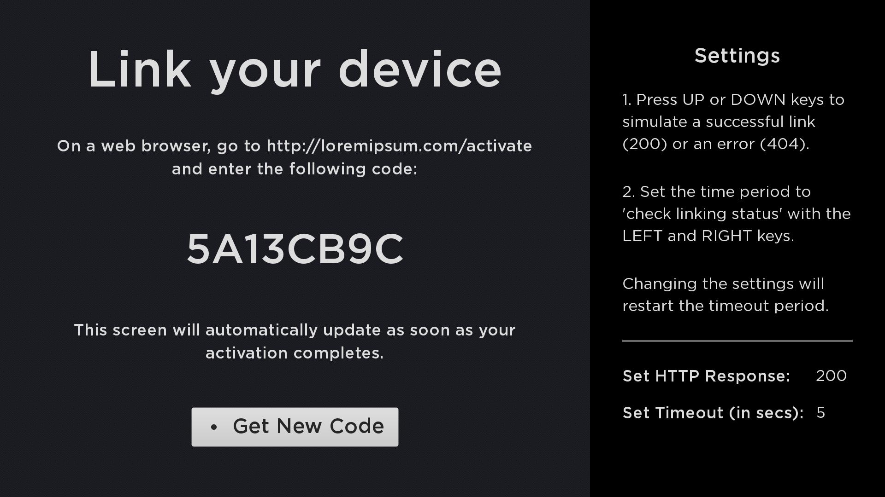
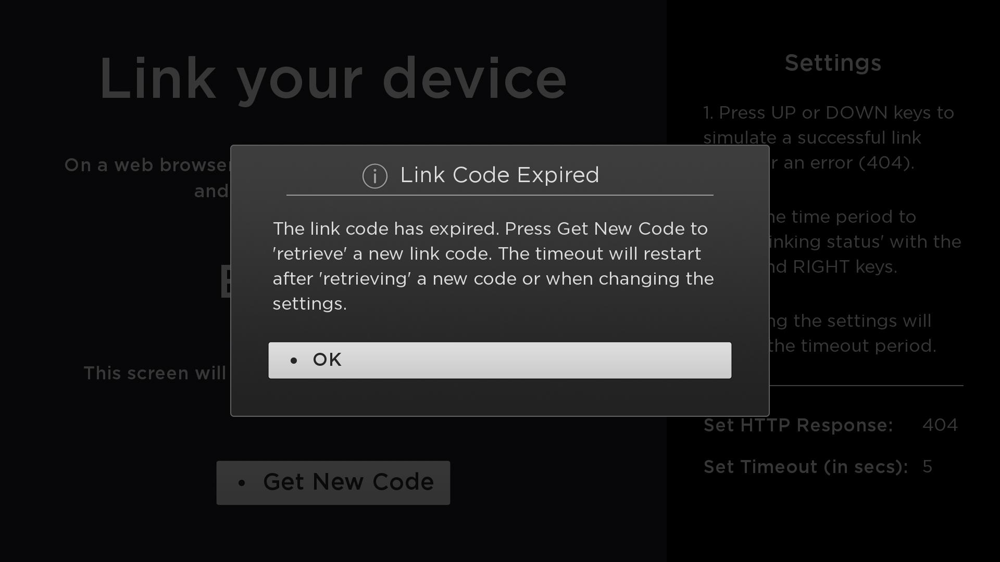
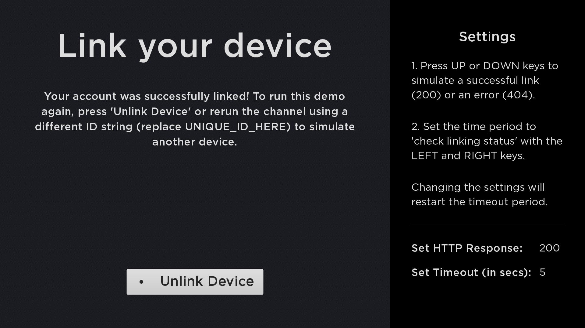

# Authentication and Linking



### Overview

This guide describes the typical flow and API used for registering and linking a device to an authentication service. The primary and recommended method for linking a device involves 3 main steps:

 1. Display a short on-screen registration code (generated on the server) on the Roku device.
 2. The user link the device by entering the registration code on the provider's website/service.
 3. The service confirms the code is correct and issues a token to the Roku device. Once the device downloads the token, the channel displays a congratulations screen and allows the user access to the video service. The next time the channel is launched, the service will check if the token matches.

This is known as the "rendezvous" style of registration.

---

## Authentication Flow

Several transactions between the device and the provider server make this work.
The steps are as follows:

**1. Pre-registration:**

* First, the device makes a "pre-registration" request to the server.
* The server generates a short registration code and sets up an entry in a database associating the code with a temporary request for linking.
* The device receives this response and displays the code to the user.

**2. Device Linking:**

* The device begins making a sequence of "link" requests to the server.
* The server responds to the link request with a "not completed" code until the user successfully enters the code into the web site, or the code expires.

**3. Linking Success:**

* When the user has successfully entered the code plus any other necessary credentials on the provider web site, the server re-associates the code with the user's real account.
* The next time the device makes a "link" query, the server responds with a permanent token that can be used to access the user's account.

All subsequent API requests use this token to uniquely identify the customer and device. A request can be made as HTTP GET with values in parameters, or HTTP POST with values in the body of the request, for example, as XML or JSON.

## Step 1: Pre-registration


This transaction is used to retrieve a registration code from the server for device registration.  The code is displayed on screen by the device and the user is requested to go to the website and enter this code.  It is desirable to make the code as short as possible to make it easy for the user to enter, yet ensure uniqueness during the retry interval.  The device will poll at a specified frequency (`retryInterval`) during registration until the device has been registered or the maximum time has expired (`retryDuration`).

**Pre-registration request:**

```xml
<preRegistration>
  <deviceID>(unique id/serial number for the device)</deviceID>
  <deviceTypeID>(optional opaque string identifying device type)</deviceTypeID>
  <firmwareVersion>(optional major.minor.build)</firmwareVersion>
</preRegistration>
```

**Response:**

```xml
<result>
  <status>success/failure</status>
  <regCode>(small ~5 character code customer will enter onto web site)</regCode>
  <retryInterval>(polling interval in secs to detect completion (e.g. 30)</retryInterval>
  <retryDuration>(max duration in secs for retries (e.g. 900) )</retryDuration>
</result>
```

## Step 2: Device Linking

This transaction is used to check the registration progress to see if the user has successfully entered their registration code on the website to link their device. This method is polled continuously at the specified interval (`retryInterval`) from the time the pre-registration request is made until a `success` response is received or until the max retry time (`retryDuration`) has elapsed. An example of the request/response is shown below in XML format:

**Link request:**

```xml
<linkAccount>
  <regCode>(current registration code from PreRegistration request)</regCode>
  <deviceID>(unique id/serial number for the device)</deviceID>
  <deviceTypeID>(opaque string identifying device type)</deviceTypeID>
</linkAccount>
```

> :information_source: The device ID **should not** be used as the authentication token as is. You can however hash the device ID to create an auth token as long as it generates a unique value each time.

**Intermediate response:**



```xml
<result>
  <status>incomplete</status>
</result>
```

The device linking request may fail for several reasons, such as:

- Missing or invalid registration code
- Expired registration code
- Customer account issue (e.g. not registered, hold, etc.)

The channel is expected to handle these types of responses gracefully.

## Step 3: Linking Success



The final response after successfully linking the device should send a token (opaque string) back to the Roku device and be written to the channel's registry. This token can then be used by the client to perform further operations on the server, such as play media. The next time the channel is launched, the service should check to see that the token matches.

**This token, and not the device serial number, should be used to identify an account on the server.**  This allows a user to disassociate (unlink) a device from an account by simply removing the channel or when doing a factory reset which causes the stored device token to be discarded.

**Final response:**

```xml
<result>
  <status>success/failure</status>
  <deviceToken>(opaque string to identify account for future requests)</deviceToken>
  <customerId>(optional customer ID if required by partner)</customerId>
  <creationTime>(optional ISO8601 date/time value)</creationTime>
</result>
```
