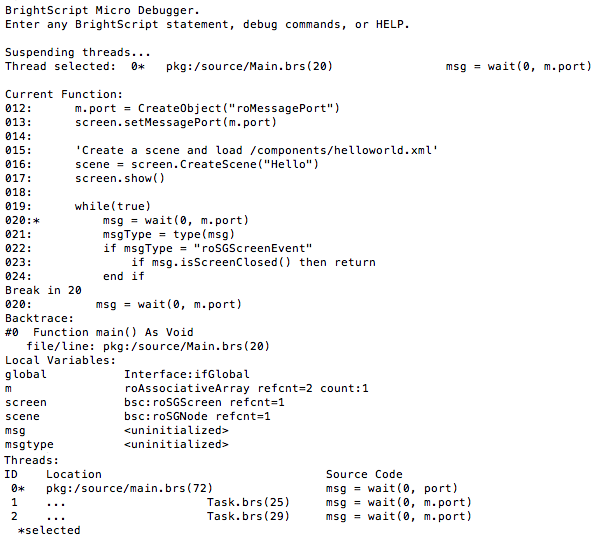

# Testing and Debugging Roku Channels

### Overview

Testing Roku Channels involves using a debug console and access to a variety of ports. The debug console provides a window into the runtime environment and provides features such as crash logs, stack-traces and much more.

**Sections:**

* [Accessing the debug console](#accessing-the-debug-console)
* [Debug ports](#debug-ports)
* [BrightScript debug console commands](#brightscript-debug-console-port-8085-commands)
* [SceneGraph debug server commands](#scenegraph-debug-server-port-8080-commands)

---

## Accessing the debug console

The [Roku Plugin for Eclipse](/develop/developer-tools/eclipse-plugin.md) contains a built-in console with access to all the available debug ports.

The debug console can also be accessed using telnet through a shell application such as [PuTTY](http://www.putty.org/) for Windows or terminal on Mac and Linux: `telnet roku-ip-adress 8085`

The console shows the output of your channel during run time. If the channel crashes, the debugger will display the line number of the error, as well as the contents of variables at the time of the crash. If there is a syntax error in the code, it will also be described here. The developer console should be open whenever a channel is side-loaded to catch any possible startup errors.

In addition to displaying console output, the shell can also be used as an interactive debugger. When your application is running, simply press `ctrl + c` to break the application and enter debug mode. You will see the BrightScript Debugger prompt where you can type in commands.

> :information_source: You can also force your channel to break at a specific point by adding the `stop` command anywhere in your code.

## Debug ports

| Port    | Thread    | Description        |
| ------- | --------- | ------------------ |
| 8080    | debug server | debug server containing a host of utilities
| 8085    | Main()    | BrightScript runtime environment
| 8087    | Screensavers | The starting point for screensavers

## BrightScript debug console (port 8085) commands

| Command | Description |
| ------- | ----------- |
| `bsc`	    | Print current BrightScript Component instances
| `bscs`    |	Print a summary of BrightScript component instance counts by component type.
| `brkd`	  | Toggle whether BrightScript should break into the debugger after non-fatal diagnostic messages.
| `bt`	    | Print backtrace of call function context frames
| `classes`	| Print Brightscript Component classes
| `cont` or `c`	| Continue Script Execution
| `down` or `d`	| Move down the function context chain one
| `exit`	  | Exit shell
| `gc`	    | Run garbage collector
| `help`	  | Print the list of debugger commands
| `last` or `l` | Print the last line that executed
| `list`	  | List current function
| `next` or `n` | Print the next line to execute
| `over`	  | Step over function (_Available since firmware version 7.2_)
| `out`	    | Step out of a function (_Available since firmware version 7.2_)
| `print`, `p`, or `?`	| Print a variable or expression
| `step`, `s`, or `t`	| Step one program statement
| `threads <ID>` or `ths <ID>`1 | List all current executed suspended threads
| `thread <ID>` or `th <ID>`1 | Select a suspended thread to debug - all following debug commands will execute within that thread
| `up` or `u`	| Move up the function context chain one
| `var`	    | Print local variables and their types/values

> Shortcuts for `next`, `last`, `threads`, and `thread` are only available in firmware verstion 7.6 and greater.

> 1 This command is only available in firmware version 7.5 and greater.

> :information_source: BrightScript statements can also be compiled and executed in the console. This can be used to change variables during execution or call a function that prints useful information about the state of your program.

## SceneGraph applications

With **firmware version 7.5+**, the main debug port (8085) now provides context for all threads. This eliminates the need to have multiple telnet sessions open for each running thread and **ports 8089 - 8093 will no longer be used.**

As seen below, any break or `stop` in the channel will suspend all threads. All threads will be listed with the following information:
* **ID**: thread ID
* **Location**: file the thread originated from and line number
* **Source Code**: current line of code

The current selected thread will be marked with an `*`.

> :information_source: This information can be recalled anytime during debugging using the `threads` command.

### SceneGraph debug server (port 8080) commands
| Command | Description |
| ------- | ----------- |
| `enhanced_dev_log rendezvous on` | Enable console logging of thread rendezvous. Set to `off` to disable.  _Available since firmware version 7.6_
| `loaded_textures` | Displays the current set of images loaded into texture memory
| `r2d2_bitmaps` | Prints a list of assets loaded into texture memory and the amount of free, used, and maximum available memory on your device, respectively.
| `sgnodes all` | Prints every existing node created by the currently running channel
| `sgnodes roots` | Prints every existing node without a parent created by the currently running channel. The existence of these unparented nodes means they are being kept alive by direct BrightScript references. These could be in variables local to a function, arrays, or associative arrays, including a component global `m` or an associative array field of a node.
| `sgnodes node_ID` | Prints nodes with an id field set to node_ID, except it bypasses all the hierarchy and rules, and just runs straight down the whole list in the order of node creation. It will list multiple nodes if there are several that match.
| `sgperf start` or `sgperf clear` or `sgperf report` or `sgperf stop` | This command provides basic node operation performance metrics. This command tracks all node operations by thread, whether its being created or an operation on an existing node, and whether it involves a rendezvous.  Settings:<ul><li>`start` - enables counting</li><li>`clear` - resets counters to zero</li><li>`report` - prints current counts with rendezvous as percentage</li><li>`stop` - disables counting</li></ul> _Available since firmware version 7.6_
| `sgversion` `force` or `default` `1.0` or `1.1` | This command can be used to change the [observer callback model](https://sdkdocs.roku.com/display/sdkdoc/Handling+Application+Events-ObserverCallbackModels) and can also override the default `rsg_version` specified in the manifest. For example, `sgversion force 1.0` will set `rsg_version=1.0` regardless of what is specified in the manifest. With `default`, it will set the default `rsg_version` when it is not specified in the manifest. Changing the `rsg_version` will require restarting the channel but these changes will not survive a device reboot.

> :information_source: These commands are similar to the getAll() , getRoots() ,  getRootsMeta(), and getAllMeta() [ifSGNodeChildren](https://sdkdocs.roku.com/display/sdkdoc/ifSGNodeChildren) methods, which can be called on any SceneGraph node.
