_Setting up pricing models and creating products for Roku channels_


### Overview

This guide will focus on setting up an in-channel product and how to use that product in a sample Roku channel. For developers new to billing, check out the overview pages on [Payments](/publish/monetization/payments.md) and [Purchases](/publish/monetization/purchases.md).

**Requirements to follow along:**

*   A Roku device: [www.roku.com/products/compare](http://www.roku.com/products/compare)
*   A Roku developer account: [developer.roku.com/enrollment/standard](http://developer.roku.com/enrollment/standard)
*   Enroll in Roku Billing Services: [developer.roku.com/enrollment/billing](https://developer.roku.com/enrollment/billing)
*   Understand how to install a sample channel ([Hello world guide](/develop/getting-started/hello-world.md))

**The primary steps for this tutorial are:**

1.  [Install the sample Roku Billing channel](#install-the-sample-roku-billing-channel)
2.  [Packaging and publishing the sample channel](#packaging-publishing-the-sample-channel)
3.  [Add an in-channel product to your Roku developer account](#add-an-in-channel-product-to-your-roku-developer-account)
4.  [Testing the in-channel product and sample code overview](#testing-the-in-channel-product-and-sample-code-overview)
5.  [Addendum: How to setup a pay-to-install channel](#addendum-how-to-setup-a-pay-to-install-channel)

---

## Install the sample Roku Billing channel

Download the [signup sample channel](https://roku.box.com/s/puqgslcujkt364cfit7a4zwx1hfps5ew). Refer to the **[Developer Setup Guide](/develop/getting-started/setup-guide)** on how to install (or "sideload") channels onto a Roku device.


## Packaging and publishing the sample channel

Once you have the sample channel side-loaded onto your device, you’ll need to generate a key to sign your package using a telnet client such as [PuTTY](http://www.putty.org/) on Windows or using the built-in client through terminal on OSX.

### A. Open a telnet session to your Roku player

**Windows:** Download the telnet client [PuTTY](http://www.putty.org/), enter the IP address of your Roku player, 8080 for the port and Telnet as the connection type.


**OSX / Linux:** Open terminal and type: telnet *your Roku player’s IP address* 8080


### B. Run the genkey utility to create a signing key

Type **genkey** and wait for the process to complete. If the prompt says “Command not recognized”, type it again.


A key has been successfully generated to sign packages. Make note of the developer ID and password as it’ll be required in the next section (and anytime code is updated and needs to be repackaged).

> :information_source: _It is a good practice to generate a new developer ID and password for each channel you create unless you explicitly want to share registry information between channels._

### C. Packaging the side-loaded channel

Return to your browser tab with the Developer Application Installer. There should now be a **Packager** option available. If you do not see this option, please go through the previous section and run genkey again.


Click on **Packager** to bring up the Application Packager page. The Dev ID should match the same developer ID that was generated with genkey. Enter an App Name and Version and enter the password created by genkey.


Click on **Package** and a few short moments later you can download the signed package using the `.pkg` link.


### D. Creating a private channel

The next step is to create a private channel with the signed package we just generated. On the [**Developer Dashboard**](https://developer.roku.com/developer), select [**Manage My Channels**](https://developer.roku.com/developer-channels/channels) and [**Add Channel**](https://developer.roku.com/apps/create/private) on the following page.

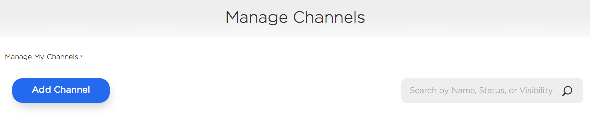

Next, select **Developer SDK**, **Private**, and enter a **Channel Name**.

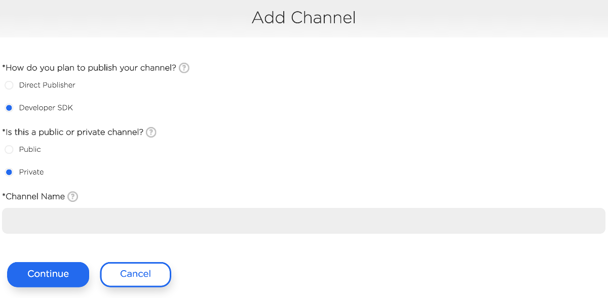

#### Properties

On the properties page, all the default values selected will be fine to use but you can adjust as needed.

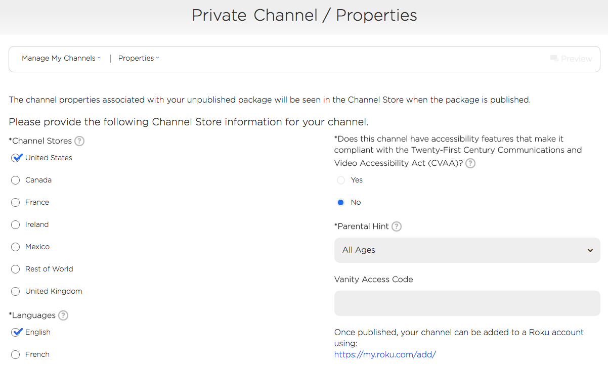

#### Channel Store Info

Edit the channel's description as needed, upload a Channel Store poster (540x405), and select a preferred category.

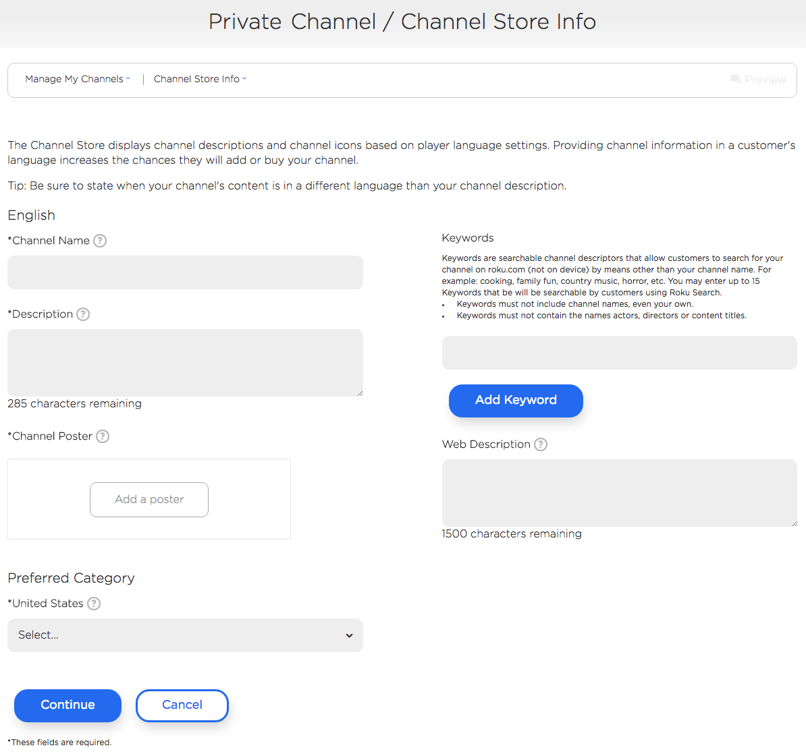

#### Monetization

On the Monetization page, select how you plan to monetize your channel. For this example, select **My channel contains in-channel subscriptions**.

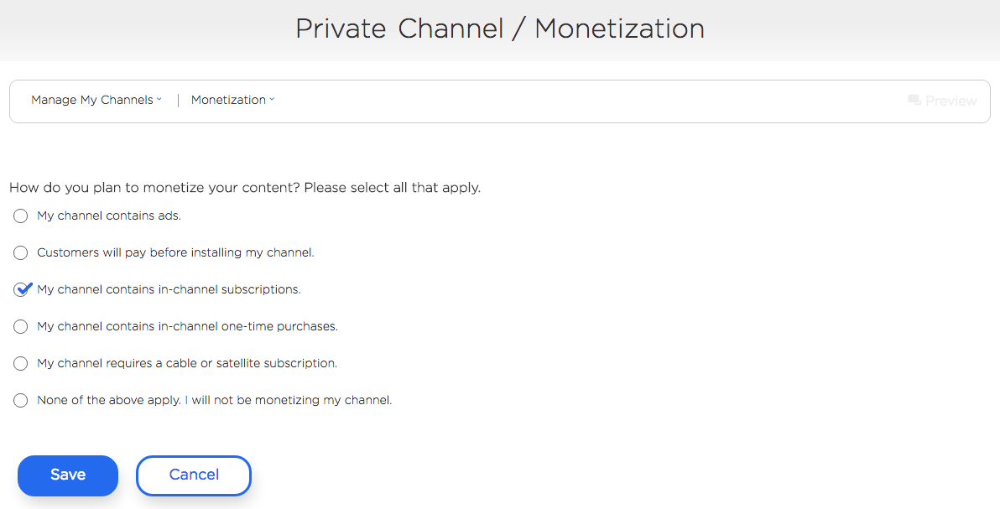

#### Package Upload

 **Upload** your signed package and click **Continue**.

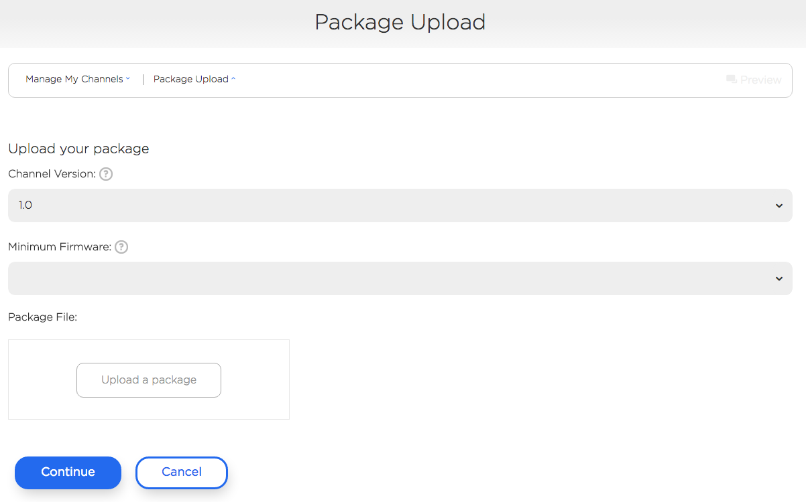

#### Preview and Publish

On the Preview and Publish page, select **Publish** at the bottom.

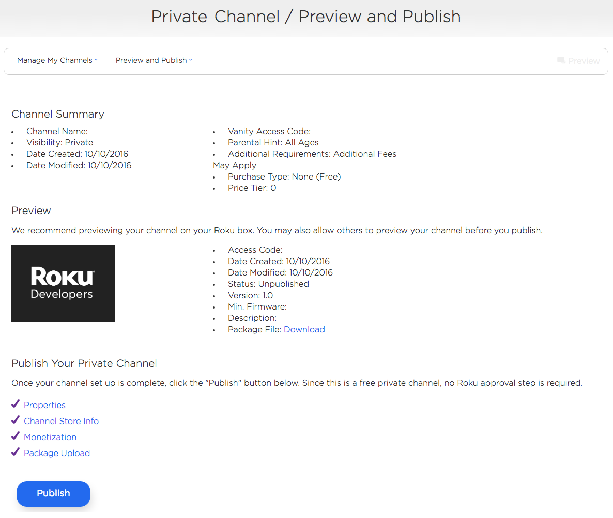

## Add an in-channel product to your Roku developer account

After you have published your private channel, the next step is to create an in-channel product. Return to the [**Developer Dashboard**](https://developer.roku.com/developer) and select [**Manage My In-Channel Products**](https://developer.roku.com/products). On the following page, select [**Add a Product**](https://developer.roku.com/products/create/digital)**.** For this example, we’ll be creating a subscription product called **monthly subscription.** Under Channels, select the private channel you just published and fill out the remaining fields as appropriate.

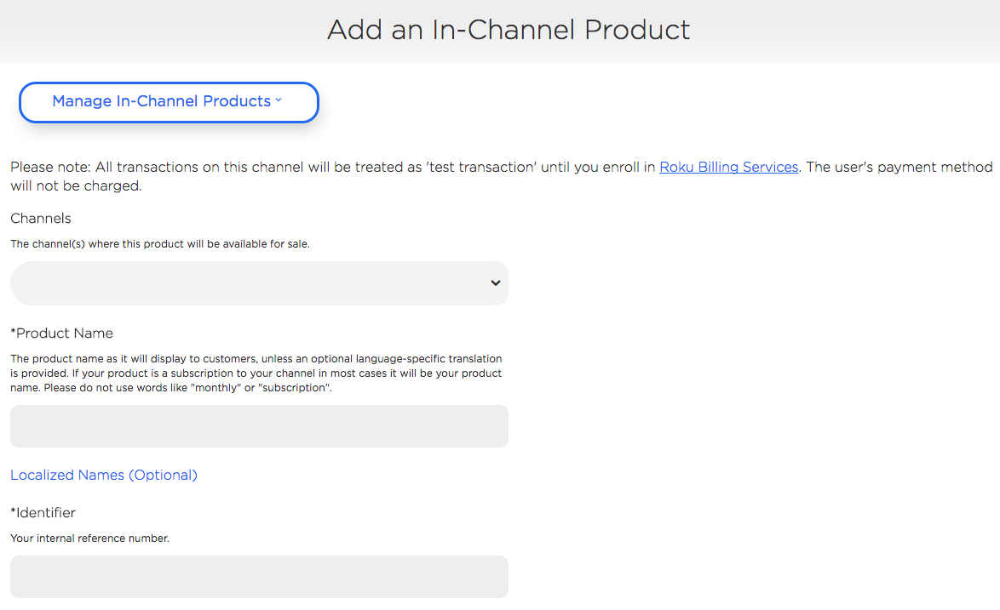

**Here is an example of the product we created:**

*   **Channels:** billingsample
*   **Product Name:** monthly subscription
*   **Identifier:** billingsample-monthlysubscription
*   **Purchase Type:** Monthly Subscription
*   **Free Trial Period:** Disabled
*   **Classification:** Video
*   **Internet Connection Required:** Yes
*   **Requires Additional Purchase:** No
*   **Cleared for Sale:** Yes
*   **Price Tier:** 5

Click **Save** when finished and you will be directed back to the [**Manage In-Channel Products** ](https://developer.roku.com/products) page.

The product you just created should be available with a **Submit for review** option. Select it and your product will change to Approved under status.

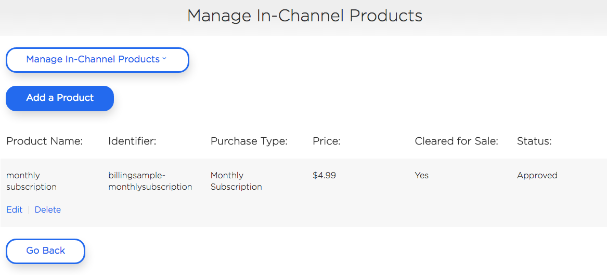

## Testing the in-channel product and sample code overview

With an approved product, we’ll now install the private channel and see if the product works. If you haven’t yet installed the private channel, return to the [**Manage Channels**](https://developer.roku.com/developer-channels/channels) page and click on **Preview and Update**.

Click on the **Access Code**/**Vanity Access Code** on the following page to add the channel to your Roku. Once the channel is installed, launch it and you should see the following screen:


Select **New subscriber (sign up)** which brings up a Request to share information dialog.

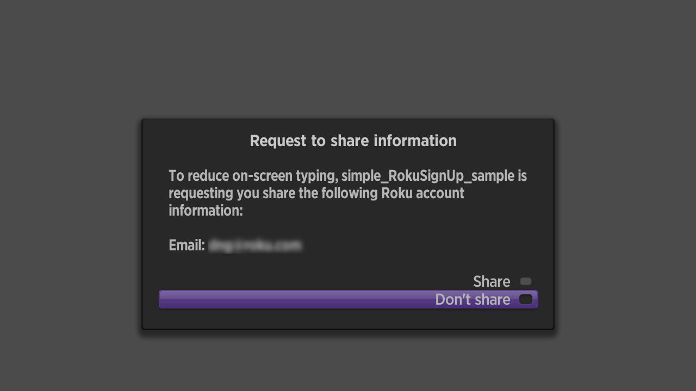

Select **Share** to use your Roku account’s email address or **Don’t share** to enter a different email on the following KeyboardDialog screen.

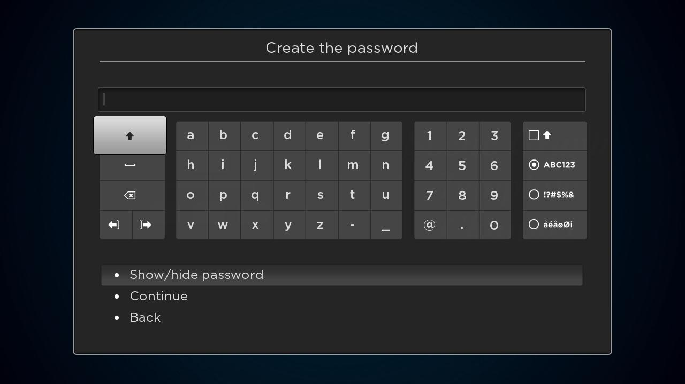

Enter a password (or play around with the error handling dialogs). The next screen displays an example Terms Of Use dialog.

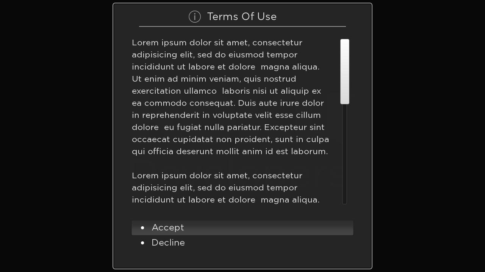

Select **Accept** to show a dialog displaying the product(s) associated with your channel. If you see the following, congrats! You’ve just successfully created a channel with an in-channel purchase.

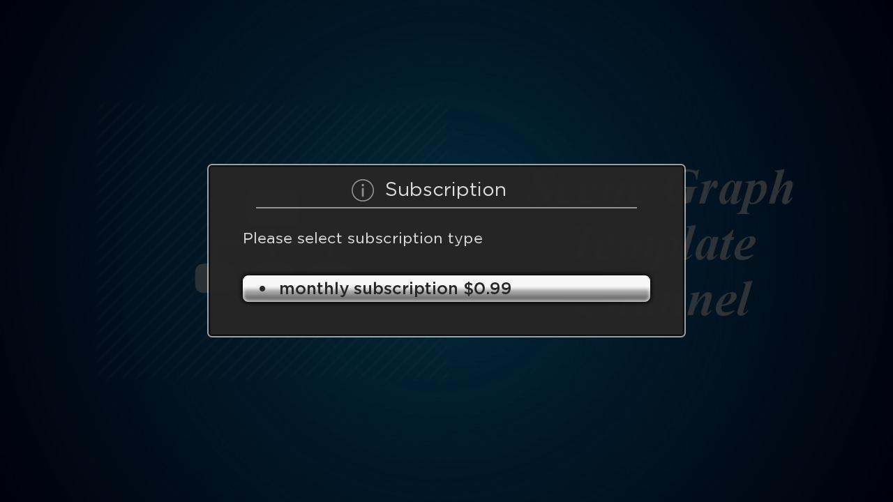

Now let’s go through the code and see how the channel is requesting the product and how it is purchased. Open up the unzipped sample source code folder (or download the sample again) and open the `components` folder. Go into the `RokuSignUp` folder and open up the `RokuBillingTask.brs` file in your code editor of choice.

### Requesting available products for purchase

To see what product(s) are available for purchase, we need to use the [`roChannelStore`](https://sdkdocs.roku.com/display/sdkdoc/roChannelStore) component. In our sample, this is set up in sub `GetPartialUserData()` in `lines 20-22`:

``` brightscript
port = CreateObject("roMessagePort")
channelStore = CreateObject("roChannelStore")
channelStore.SetMessagePort(port)
```

Now that we have an interface to the Channel Store, we can make requests to see what products are available for purchase and what products have already been purchased. In our sample, we make these requests through sub `GetProducts()` which provides an associative array of products available for purchase.

``` brightscript
sub GetProducts()
    result = {
        availForPurchase : {
            list : []
            map  : {}
        }
        validPurchased : {
            list : []
            map  : {}
        }
    }
    allProducts = Helper_GetAllProducts()
    purchasedProducts = Helper_GetPurchasedProducts()

    datetime = CreateObject("roDateTime")
    utimeNow = datetime.AsSeconds()

    for each product in allProducts
        bAddToAvail = true
        for each purchase in purchasedProducts
            if purchase.code = product.code then
                bAddToAvail = false
                if purchase.expirationDate  invalid then
                    datetime.FromISO8601String(purchase.expirationDate)
                    utimeExpire = datetime.AsSeconds()
                    if utimeExpire > utimeNow then
                        result.validPurchased.list.Push(purchase)
                        result.validPurchased.map[purchase.code] = purchase
                    end if
                end if
                exit for
            end if
        end for

        if bAddToAvail then
            result.availForPurchase.list.Push(product)
            result.availForPurchase.map[product.code] = product
        end if
    end for

    m.top.products = result
end sub
```

On `lines 40-41`, you’ll see two helper functions, `Helper_GetAllProducts()` and `Helper_GetPurchasedProducts()`. `Helper_GetAllProducts()` returns an associative array with the details for each product associated with the channel.

``` brightscript
function Helper_GetAllProducts() as Object
    result = []

    port = CreateObject("roMessagePort")
    channelStore = CreateObject("roChannelStore")
    channelStore.SetMessagePort(port)

    channelStore.GetCatalog()
    msg = invalid
    while type(msg)  "roChannelStoreEvent"
        msg = Wait(0, port)
    end while

    if msg.isRequestSucceeded() then
        response = msg.GetResponse()
        if response  invalid then
            result = response
        end if
    end if

    return result
end function
```

`Helper_GetPurchasedProducts()` returns an associative array with the details for each valid product (i.e. a subscription that has not expired) the user has purchased.

``` brightscript
function Helper_GetPurchasedProducts()
    result = []

    port = CreateObject("roMessagePort")
    channelStore = CreateObject("roChannelStore")
    channelStore.SetMessagePort(port)

    channelStore.GetPurchases()
    msg = invalid
    while type(msg)  "roChannelStoreEvent"
        msg = Wait(0, port)
    end while

    if msg.isRequestSucceeded() then
        response = msg.GetResponse()
        if response  invalid then
            result = response
        end if
    end if

    return result
end function
```

Returning to sub `GetProducts()`, `lines 43-67` determines whether a subscription product that has been purchased has expired and is available for purchasing again.

### Purchasing the product

Now that we know what products are available for purchase, we need to set up a couple of calls to actually purchase the product. In our sample, this is done in sub `PurchaseProduct()`.

``` brightscript
sub PurchaseProduct()
    port = CreateObject("roMessagePort")
    channelStore = CreateObject("roChannelStore")
    channelStore.SetMessagePort(port)

    channelStore.ClearOrder()
    channelStore.SetOrder([{
        code : m.top.products.availForPurchase.list[m.top.indexPurchase].code
        qty  : 1
    }])
    channelStore.DoOrder()
    msg = invalid
    while type(msg)  "roChannelStoreEvent"
        msg = Wait(0, port)
    end while

    result = {
        isSuccess : msg.isRequestSucceeded()
    }
    if msg.isRequestSucceeded() then
        response = msg.GetResponse()
        if response  invalid AND response[0]  invalid then
            result.Append(response[0])
        end if
    else if msg.isRequestFailed() then
        result.failureCode = msg.GetStatus()
        result.failureMessage = msg.GetStatusMessage()
    end if

    m.top.purchaseResult = result
end sub
```

This task function is called when the user selects the product from the dialog. We determine which product is selected with the `indexPurchase` field, referencing the current index in the Subscription dialog seen below.


In `line 80`, we call `ClearOrder()` which is good practice to be sure we don’t have any anomalies when creating an order. In `lines 81-85`, the order is set up using the product identifier specified when the product was created. In `SetOrder()`, we are using a quantity of `1` as we are focusing on subscriptions for this example. Once we have the order set up, the final step is to place the order. This is done in `line 85: channelStore.DoOrder()` The remaining lines of code in sub `PurchaseProduct()` ensures that we get a response that the order was placed successfully or display an error if the purchase failed.

## Addendum: How to setup a pay-to-install channel

In addition to in-channel purchases, we also offer a "pay-to-install" option for channels. Pay-to-install requires users to purchase before the channel can be installed. This pricing model is best suited for apps such as screensavers and themes where users can quickly see what is offered by reviewing the Channel Store details.

To set up a channel with pay-to-install pricing, on the **Monetization** page, select "**Customers will pay before installing my channel"** and any other options as appropriate.

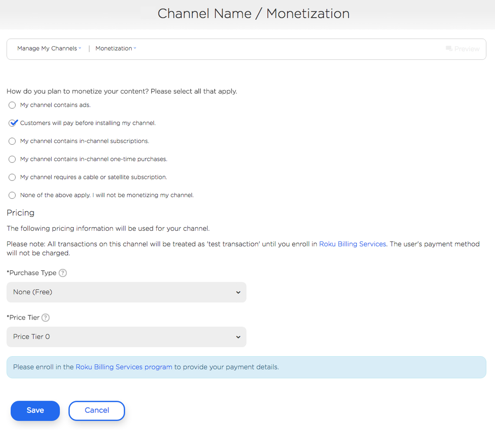

You can the select the **Purchase Type**: one-time purchase, monthly subscription or yearly subscription, and a corresponding **Price Tier**.

**Related resources:**

* [Enroll in Roku Billing](https://developer.roku.com/enrollment/billing)
* [signup sample channel](https://roku.box.com/s/puqgslcujkt364cfit7a4zwx1hfps5ew)
* [roChannelStore](https://sdkdocs.roku.com/display/sdkdoc/roChannelStore)
* [ifChannelStore](https://sdkdocs.roku.com/display/sdkdoc/ifChannelStore)
* [roChannelStoreEvent](https://sdkdocs.roku.com/display/sdkdoc/roChannelStoreEvent)
